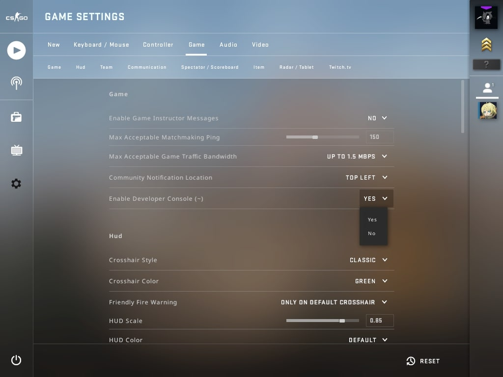

[](#) [](#)

## 👨‍💻 Activating Developer Console



To activate developer's console you need to go to **game options** and update _"Activate Developer Console"_ option to _"Yes"_. Now, you just need to press ` " ` or `` ` `` during the game to open developer's console.

## 🙋‍♂️ My Settings

### ⚙️ General

| Option               | Value            |
|----------------------|:----------------:|
| Video                | `1920x1080 16:9` |
| Reverse Mouse        | `OFF`            |
| Duck Mode            | `HOLD`           |
| Walk Mode            | `TOGGLE`         |
| Mouse Sensitivity `*`| `2.20`           |
| Zoom Sensitivity     | `1.00`           |
| Raw Input            | `ON`             |
| Mouse Acceleration   | `OFF`            |

> `*` Windows and CS GO mouse input configuration set to `RAW INPUT`.

### 🖥 HUD & Stuff
```cfg
net_graph 1
cl_disablefreezecam 1
fps_max 100
mm_dedicated_search_maxping 50
cl_radar_always_centered 0
cl_radar_scale 0.45
cl_hud_radar_scale 1.15
cl_radar_icon_scale_min 1
cl_radar_rotate 1
cl_radar_square_with_scoreboard 1
```

### 🎯 Crosshair
```cfg
cl_crosshair_drawoutline = 1 
cl_crosshair_dynamic_maxdist_splitratio = 0.35 
cl_crosshair_dynamic_splitalpha_innermod = 1 
cl_crosshair_dynamic_splitalpha_outermod = 0.5 
cl_crosshair_dynamic_splitdist = 7 
cl_crosshair_friendly_warning = 1 
cl_crosshair_outlinethickness = 1 
cl_crosshair_recoil = 0 
cl_crosshair_sniper_show_normal_inaccuracy = 0 
cl_crosshair_sniper_width = 1 
cl_crosshair_t = 0 
cl_crosshairalpha = 200 
cl_crosshaircolor = 1 
cl_crosshaircolor_b = 50 
cl_crosshaircolor_g = 250 
cl_crosshairdot = 0 
cl_crosshairgap = 0.000000 
cl_crosshairgap_useweaponvalue = 0 
cl_crosshairstyle 5 
cl_crosshairthickness = 0.800000 
cl_crosshairusealpha = 1 
```

### 👀 View Model
```cfg
viewmodel_fov 68
viewmodel_offset_x 2.5
viewmodel_offset_y 0
viewmodel_offset_z -1.5
viewmodel_presetpos 3
cl_viewmodel_shift_left_amt 0.5
cl_viewmodel_shift_right_amt 0.25
viewmodel_recoil 0
cl_righthand 1
```

## 🌎 Related Links
- [CS:GO on Steam](https://store.steampowered.com/app/730/CounterStrike_Global_Offensive/)
- [CS:GO Crosshair Generator](https://tools.dathost.net/)
- [CS:GO Top 10 Essential Commands](https://www.ligadosgames.com/comandos-cs-go/)
- [CS:GO Training Commands](https://www.ligadosgames.com/comandos-cs-go-treino/)
